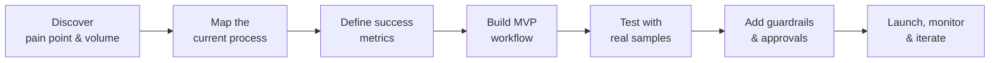

# AI Automation Portfolio

**Irum Ishaq Bukhari** · Senior Product & Project Manager → AI Automation

No-code / low-code automation with **n8n**, **Make** and **Zapier**, powered by LLMs (OpenAI GPT-4o family).

I design automations the way I run programs: start from the business problem, map the process, define success metrics, then build the smallest workflow that removes the manual work — with error handling, human approval where it matters, and a log for every run.

---

## Projects

| # | Project | Platform | Business area | What it automates |
|---|---------|----------|---------------|-------------------|
| 01 | [Meeting Notes → Action Items](projects/01-n8n-meeting-notes-to-action-items) | n8n | Project management | Turns a meeting transcript into decisions, owners and due dates, creates Trello cards and posts a Slack recap |
| 02 | [AI Support Inbox Triage](projects/02-n8n-ai-support-inbox-triage) | n8n | Customer support | Classifies every incoming email by category, urgency and sentiment, alerts on urgent issues and drafts replies |
| 03 | [AI Lead Qualification & CRM Routing](projects/03-make-ai-lead-qualification) | Make | Sales | Scores inbound leads with AI, routes hot leads to sales in HubSpot + Slack and sends warm leads a personalised follow-up |
| 04 | [Weekly Project Status Report](projects/04-make-weekly-project-status-report) | Make | PMO / operations | Pulls tasks and risks every Friday and writes an executive status report in Google Docs with RAG status |
| 05 | [AI Content Repurposing Engine](projects/05-zapier-ai-content-repurposing) | Zapier | Marketing | Converts each new blog post into LinkedIn, X and newsletter copy with a human approval step before scheduling |
| 06 | [Invoice Processing (Accounts Payable)](projects/06-zapier-invoice-processing) | Zapier | Finance | Extracts invoice data from email attachments, logs it, and routes invoices over a threshold for approval |

Each project folder contains:

- **README** — problem, solution, architecture diagram, step-by-step build, AI prompts, error handling and expected impact
- **Workflow file** — importable n8n workflow JSON (projects 01–02)
- **Sample data** — test payloads so the workflow can be run end-to-end

---

## Skills demonstrated

| Area | Details |
|------|---------|
| Platforms | n8n (self-hosted & cloud), Make (scenarios, routers, filters, iterators), Zapier (multi-step Zaps, Paths, Filters, Formatter, Tables) |
| AI / LLM | Prompt design for structured JSON output, classification, extraction, summarisation, drafting; guardrails and confidence thresholds |
| Integrations | Gmail, Slack, Google Sheets, Google Docs, Trello, HubSpot, Typeform, Jira, RSS, Buffer, QuickBooks, webhooks |
| Reliability | Error branches, retries, deduplication, human-in-the-loop approval, run logging, alerting |
| Delivery | Process mapping, requirements, stakeholder sign-off, KPI definition, documentation and hand-over |

## How I approach an automation project



1. **Discover** — how often does the task happen, how long does it take, what does an error cost?
2. **Map** — current-state process, systems involved, who approves what.
3. **Measure** — agree the KPI up front (hours saved, response time, error rate).
4. **Build** — smallest workflow that delivers value; AI only where rules aren't enough.
5. **Harden** — error handling, logging, human approval for high-risk actions.
6. **Hand over** — documentation so the team can own and extend it.

---

## Repository structure

```
ai-automation-portfolio/
├── README.md
└── projects/
    ├── 01-n8n-meeting-notes-to-action-items/
    ├── 02-n8n-ai-support-inbox-triage/
    ├── 03-make-ai-lead-qualification/
    ├── 04-make-weekly-project-status-report/
    ├── 05-zapier-ai-content-repurposing/
    └── 06-zapier-invoice-processing/
```

> Impact figures in each project are estimates based on the stated assumptions (volume × minutes saved), not audited client results.

## Contact

Open to **AI Automation Specialist / Automation Consultant / AI Operations** roles and freelance projects.
GitHub: [@iramnoor](https://github.com/iramnoor)
