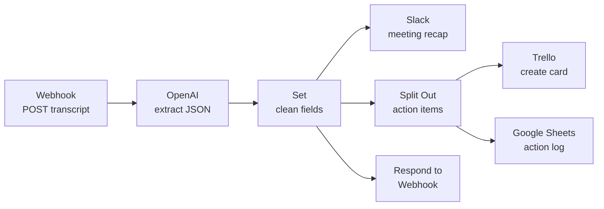

# 01 · Meeting Notes → Action Items (n8n + OpenAI)

**Platform:** n8n · **AI:** OpenAI GPT-4o-mini · **Apps:** Webhook, Trello, Slack, Google Sheets
**Business area:** Project management / PMO

## The problem

After every project meeting someone has to re-read the notes, pull out the decisions and action items, chase owners for due dates, create tasks in the tracker and send a recap. On a program with 8–10 meetings a week that is 3–5 hours of admin, and action items still get lost.

## The solution

Paste or send a meeting transcript (from Zoom, Teams, Otter, Fireflies or typed notes) to a webhook. The workflow:

1. Sends the transcript to GPT-4o-mini with a prompt that returns **structured JSON**: summary, decisions, action items (task, owner, due date, priority) and risks.
2. Creates a **Trello card** for every action item, with owner and due date.
3. Posts a formatted **Slack recap** to the project channel.
4. Logs every action item to a **Google Sheet** (the action log / audit trail).
5. Returns a JSON response to the caller so it can be triggered from a form, Zapier, or another tool.

## Architecture



## Files

| File | Purpose |
|------|---------|
| `workflow.json` | Importable n8n workflow (n8n → *Workflows* → *Import from File*) |
| `sample-transcript.json` | Test payload to POST to the webhook |

## Setup

1. Import `workflow.json` into n8n.
2. Add credentials: **OpenAI**, **Trello**, **Slack**, **Google Sheets**.
3. In the **Trello** node, select the board list for new tasks.
4. In the **Google Sheets** node, select a sheet with columns: `meeting_title, task, owner, due_date, priority, logged_at`.
5. In the **Slack** node, choose your project channel.
6. Activate the workflow and send the sample:

```bash
curl -X POST https://<your-n8n>/webhook/meeting-notes \
  -H "Content-Type: application/json" \
  -d @sample-transcript.json
```

## AI prompt (system message)

```text
You are a senior project coordinator. Read the meeting transcript and return ONLY valid JSON:
{
  "summary": "3-4 sentence summary",
  "decisions": ["..."],
  "action_items": [
    {"task": "...", "owner": "name or 'Unassigned'", "due_date": "YYYY-MM-DD or null", "priority": "High|Medium|Low"}
  ],
  "risks": ["..."]
}
Rules: only include action items someone committed to. Convert relative dates ("next Friday")
using the meeting date. Never invent owners or dates — use "Unassigned" / null.
```

Design choices:
- **JSON output mode** is enabled on the OpenAI node so the response is parsed automatically — no code node needed.
- The "never invent owners" rule keeps the model from hallucinating assignments; unassigned items are flagged in Slack for the PM to follow up.
- Temperature is kept low (0.2) for consistent extraction.

## Error handling

- The OpenAI node retries up to 3 times on failure.
- Items with `owner = "Unassigned"` are highlighted in the Slack recap.
- Every run is logged to Google Sheets, so nothing depends on Slack history.
- Recommended: set an n8n **Error Workflow** that posts failures to a `#automation-alerts` channel.

## Expected impact

| Metric | Before | After |
|--------|--------|-------|
| Time to publish recap & tasks | 20–30 min per meeting | < 1 min |
| Admin time (10 meetings/week) | ~4 hrs/week | ~30 min/week (review only) |
| Action items tracked | Inconsistent | 100% logged with owner & date |

*Estimates assume 10 meetings per week and 25 minutes of manual follow-up per meeting.*

## Possible extensions

- Trigger automatically when a new transcript lands in Google Drive / Fireflies.
- Email each owner their own action items.
- Swap Trello for Asana, Jira, ClickUp or Monday.com.
