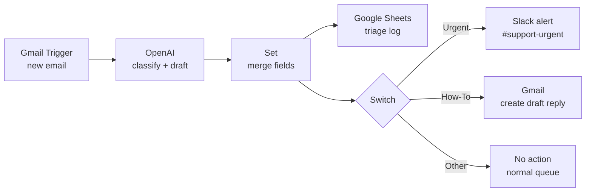

# 02 · AI Support Inbox Triage (n8n + OpenAI)

**Platform:** n8n · **AI:** OpenAI GPT-4o-mini · **Apps:** Gmail, Slack, Google Sheets
**Business area:** Customer support / operations

## The problem

A small support team shares one inbox. Urgent issues (outages, billing errors, angry customers) sit next to newsletters and "how do I…" questions. Someone reads every email just to decide what to do with it, and urgent emails can wait hours.

## The solution

Every new email is read by AI and classified before a human sees it:

| Field | Values |
|-------|--------|
| `category` | Billing, Technical Issue, How-To Question, Feature Request, Complaint, Spam/Other |
| `urgency` | High, Medium, Low |
| `sentiment` | Positive, Neutral, Negative |
| `summary` | One-line summary |
| `suggested_reply` | Draft answer for simple questions |

Then a **Switch** routes it:

- **Urgent** (urgency = High) → instant Slack alert to `#support-urgent` with summary and link.
- **How-To Question** → AI draft reply saved in Gmail (a human reviews and presses Send — nothing is sent automatically).
- **Everything else** → logged for the normal queue.

Every email is logged to Google Sheets for reporting (volume by category, response-time tracking).

## Architecture



## Files

| File | Purpose |
|------|---------|
| `workflow.json` | Importable n8n workflow |
| `sample-emails.json` | Five test emails covering each route, with the expected classification |

## Setup

1. Import `workflow.json` into n8n.
2. Add credentials: **Gmail (OAuth2)**, **OpenAI**, **Slack**, **Google Sheets**.
3. Create a Google Sheet tab `Triage Log` with columns: `received_at, from, subject, category, urgency, sentiment, summary`.
4. Pick your Slack channel in **Slack - Urgent Alert**.
5. Activate. Send yourself the sample emails to test each route.

## AI prompt (system message)

```text
You are a customer support triage assistant for a SaaS company.
Classify the email and return ONLY JSON:
{"category": "Billing|Technical Issue|How-To Question|Feature Request|Complaint|Spam/Other",
 "urgency": "High|Medium|Low",
 "sentiment": "Positive|Neutral|Negative",
 "summary": "one sentence",
 "suggested_reply": "short friendly reply, or empty string if a human must handle it"}
Urgency is High if: service is down, customer cannot log in or pay, legal/cancellation threat,
or strongly negative sentiment. Only write suggested_reply for How-To Questions.
Never promise refunds, discounts or dates.
```

## Guardrails

- **Human in the loop:** AI replies are saved as *drafts*, never sent automatically.
- **No commitments:** the prompt forbids promising refunds, discounts or timelines.
- **Fallback route:** anything that doesn't match a rule goes to the normal queue, not dropped.
- **Retries** on the OpenAI node; recommended n8n Error Workflow for failures.

## Expected impact

| Metric | Before | After |
|--------|--------|-------|
| Time to spot an urgent email | Up to several hours | < 1 minute (Slack alert) |
| Time spent sorting the inbox | ~1 hr/day | ~10 min/day |
| First reply on How-To questions | Written from scratch | Draft ready for review |

*Assumes ~80 emails/day and ~45 seconds to read and sort each manually.*

## Possible extensions

- Apply Gmail labels per category.
- Look up the customer in the CRM and include their plan / account value in the alert.
- Add a knowledge-base lookup (RAG) so drafts use your actual help articles.
