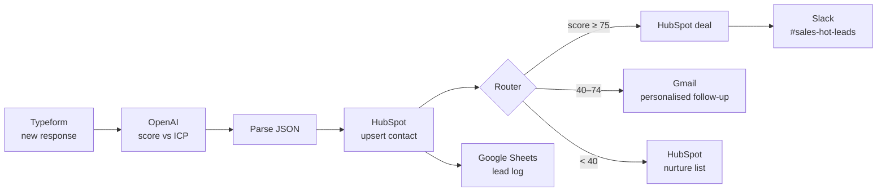

# 03 · AI Lead Qualification & CRM Routing (Make + OpenAI)

**Platform:** Make (formerly Integromat) · **AI:** OpenAI GPT-4o-mini · **Apps:** Typeform (or webhook), HubSpot, Slack, Gmail, Google Sheets
**Business area:** Sales / revenue operations

## The problem

Inbound leads from the website form land in a shared inbox. Sales reps open each one, Google the company, guess whether it's a good fit and copy details into the CRM. Good leads wait a day for a reply; poor-fit leads waste rep time.

## The solution

A Make scenario that qualifies every lead in seconds:

1. **Typeform → Watch Responses** (or a Custom Webhook) receives the lead.
2. **OpenAI → Create a Completion** scores the lead 0–100 against the Ideal Customer Profile and returns JSON: `score`, `tier`, `reason`, `company_size_guess`, `use_case`, `personalised_opener`.
3. **JSON → Parse JSON** turns the answer into mappable fields.
4. **HubSpot → Create/Update a Contact** with the score and tier saved to custom properties.
5. **Router** with three filtered routes:

| Route | Filter | Actions |
|-------|--------|---------|
| 🔥 Hot | `score ≥ 75` | HubSpot **Create a Deal** → Slack message to `#sales-hot-leads` with the AI reason and opener |
| 🌤 Warm | `40 ≤ score < 75` | Gmail **Send an Email** — personalised follow-up using the AI opener + booking link |
| ❄️ Cold | `score < 40` | Added to the HubSpot nurture list only |

6. **Google Sheets → Add a Row** logs every lead with its score (runs on all routes for reporting).

## Architecture



## Build guide (module by module)

| # | Module | Key settings |
|---|--------|--------------|
| 1 | Typeform · Watch Responses | Form: *Contact Sales*. Fields: name, email, company, website, role, team size, message |
| 2 | OpenAI · Create a Completion | Model `gpt-4o-mini`, temperature `0.2`, response format **JSON object**, prompt below |
| 3 | JSON · Parse JSON | Data structure: `score (number), tier (text), reason (text), company_size_guess (text), use_case (text), personalised_opener (text)` |
| 4 | HubSpot · Create or Update a Contact | Email = `1.email`; custom properties `ai_lead_score = 3.score`, `ai_lead_tier = 3.tier` |
| 5 | Router | 3 routes with the filters in the table above + a 4th route to Google Sheets (no filter) |
| 6 | HubSpot · Create a Deal | Deal name `{{1.company}} – Inbound`, stage *Qualified to buy*, associate with contact ID from module 4 |
| 7 | Slack · Create a Message | Channel `#sales-hot-leads` |
| 8 | Gmail · Send an Email | To `1.email`, body built from `3.personalised_opener` + Calendly link |
| 9 | HubSpot · Add Contact to a List | List *Nurture – Low fit* |
| 10 | Google Sheets · Add a Row | Sheet *Lead Log* |

**Error handling:** a **Break** error handler on the OpenAI module (3 retries, 5-minute interval) and an **Ignore** handler on the Slack module so a Slack outage never blocks the CRM update. Scenario setting *Allow storing incomplete executions* is ON so failed runs can be replayed.

## AI prompt

```text
You are a B2B sales development rep. Our Ideal Customer Profile:
- B2B companies with 20–500 employees
- Operations, RevOps or Project Management teams
- Pain: manual processes, disconnected tools, reporting overhead
- Decision makers: Head of / Director / VP / Founder

Score this lead 0–100 for fit and buying intent. Return ONLY JSON:
{"score": 0-100, "tier": "Hot|Warm|Cold", "reason": "max 2 sentences",
 "company_size_guess": "...", "use_case": "...",
 "personalised_opener": "1-2 sentence opener referencing their message"}

Lead:
Name: {{1.name}} | Role: {{1.role}} | Company: {{1.company}} ({{1.website}})
Team size: {{1.team_size}}
Message: {{1.message}}
```

## Test data

`sample-leads.json` contains three leads (hot, warm, cold) to run through the scenario with **Run once**.

## Expected impact

| Metric | Before | After |
|--------|--------|-------|
| Speed to first response (hot leads) | ~24 hours | < 5 minutes |
| Rep time spent qualifying | ~10 min per lead | 0 (review only) |
| CRM data completeness | Partial, manual | 100% with score & reason |

*Assumes 150 inbound leads/month.* Make operations used: ~8 per lead → ~1,200 ops/month (fits Make Core plan).

## Possible extensions

- Add Clearbit / Apollo enrichment before scoring.
- Round-robin assignment of hot leads to reps.
- Weekly Slack digest of lead volume by tier.
