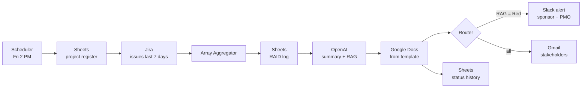

# 04 · Weekly Project Status Report Generator (Make + OpenAI)

**Platform:** Make · **AI:** OpenAI GPT-4o · **Apps:** Jira (or Asana), Google Sheets (RAID log), Google Docs, Gmail, Slack
**Business area:** PMO / program management

## The problem

Every Friday, project managers spend 1–2 hours per project assembling a status report: exporting tasks, counting what's done and overdue, copying risks from the RAID log, writing an executive summary and deciding a Red/Amber/Green status. Reports are late, inconsistent between PMs, and the data is stale by the time leadership reads it.

## The solution

A scheduled Make scenario produces a consistent, data-driven status report for every active project:

1. **Scheduler** — every Friday at 2:00 PM.
2. **Google Sheets → Search Rows** — reads the *Project Register* (project name, Jira key, sponsor, stakeholder emails, target date). One bundle per active project.
3. **Jira → Search Issues (JQL)** — `project = {{key}} AND updated >= -7d` to get the week's work.
4. **Array Aggregator** — rolls issues up into completed / in progress / overdue / blocked lists.
5. **Google Sheets → Search Rows** — open items from the project's **RAID log** (Risks, Assumptions, Issues, Dependencies).
6. **OpenAI → Create a Completion** — writes the executive summary, key accomplishments, next week's plan, and proposes a **RAG status** with justification using explicit rules.
7. **Google Docs → Create a Document from a Template** — fills the company status-report template.
8. **Router:**
   - **Red** status → Slack alert to the sponsor + PMO channel immediately.
   - All projects → **Gmail** sends the report link to stakeholders.
9. **Google Sheets → Add a Row** — status history (week, project, RAG, % complete) for trend reporting.

## Architecture



## RAG rules given to the AI

The model does **not** decide status on "feel" — it applies agreed rules and must justify the result:

| Status | Rule |
|--------|------|
| 🟢 Green | < 10% of in-scope issues overdue, no open High risks, milestone date on track |
| 🟡 Amber | 10–25% overdue **or** 1 open High risk **or** milestone at risk by ≤ 2 weeks |
| 🔴 Red | > 25% overdue **or** 2+ open High risks **or** blocked critical-path item **or** milestone slip > 2 weeks |

The PM can override the RAG in the Google Doc before it goes out (optional approval step using a Slack button / Make *Webhook response*).

## AI prompt

```text
You are a PMO analyst writing a weekly status report for executives.
Use ONLY the data provided. Be concise and factual; no filler.

Project: {{project_name}} | Sponsor: {{sponsor}} | Target date: {{target_date}}
Completed this week: {{completed_list}}
In progress: {{in_progress_list}}
Overdue: {{overdue_list}}   Blocked: {{blocked_list}}
Open RAID items: {{raid_items}}

Apply these RAG rules: <rules table>
Return ONLY JSON:
{"rag": "Green|Amber|Red", "rag_reason": "...",
 "executive_summary": "max 80 words",
 "accomplishments": ["..."], "next_week": ["..."],
 "top_risks": [{"risk": "...", "mitigation": "...", "owner": "..."}],
 "decisions_needed": ["..."]}
```

## Template placeholders (Google Doc)

`{{project_name}}`, `{{week_ending}}`, `{{rag}}`, `{{rag_reason}}`, `{{executive_summary}}`, `{{accomplishments}}`, `{{next_week}}`, `{{top_risks}}`, `{{decisions_needed}}`, `{{percent_complete}}`

## Files

| File | Purpose |
|------|---------|
| `sample-project-data.json` | Example project register row, Jira issues and RAID items to test the prompt and template |

## Expected impact

| Metric | Before | After |
|--------|--------|-------|
| PM time per report | 60–90 min | ~10 min review |
| Report consistency | Varies by PM | Same template & RAG rules for every project |
| Leadership visibility | Friday evening / Monday | Friday 2:15 PM, Red projects flagged instantly |

*Assumes a PMO of 6 projects → ~7 hours saved per week.*

## Why this project matters

Built from my own experience as a Senior Program Manager: status reporting is the most repeated, least valuable part of the PM week. Automating the assembly frees PMs to spend the time on the risks and decisions the report surfaces.
