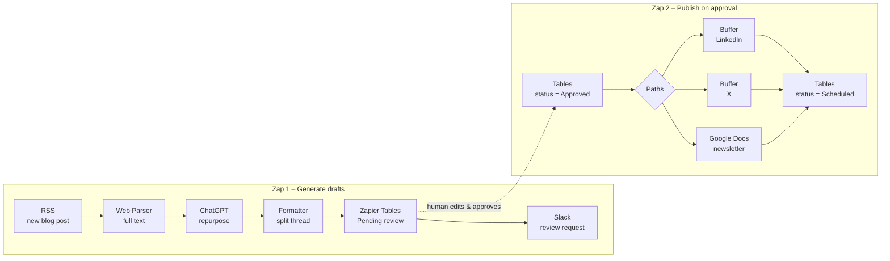

# 05 · AI Content Repurposing Engine (Zapier + ChatGPT)

**Platform:** Zapier · **AI:** ChatGPT (OpenAI) by Zapier · **Apps:** RSS by Zapier, Zapier Tables, Slack, Buffer, Google Docs
**Business area:** Marketing / content operations

## The problem

A marketing team publishes 2–3 blog posts a week, but each post only gets shared once. Rewriting every article into LinkedIn posts, X threads and a newsletter blurb takes a marketer about an hour per article, so most content is under-promoted.

## The solution

Two Zaps work together, with a human approval step in the middle:

### Zap 1 — Generate drafts

| Step | App & event | Configuration |
|------|-------------|---------------|
| 1 | **RSS by Zapier** · New Item in Feed | Company blog RSS URL |
| 2 | **Web Parser by Zapier** · Parse Webpage | Pull the full article text from the item link |
| 3 | **ChatGPT** · Conversation | Prompt below → returns LinkedIn post, X thread, newsletter blurb, 3 hooks, hashtags |
| 4 | **Formatter by Zapier** · Text → Split | Split the X thread into separate tweets on `---` |
| 5 | **Zapier Tables** · Create Record | Table *Content Queue*: title, URL, LinkedIn draft, X thread, newsletter, status = `Pending review` |
| 6 | **Slack** · Send Channel Message | `#marketing-content`: "New drafts ready for *{{title}}* — review in the Content Queue" + table link |

### Zap 2 — Publish on approval

| Step | App & event | Configuration |
|------|-------------|---------------|
| 1 | **Zapier Tables** · Updated Record | Trigger when `status` changes |
| 2 | **Filter by Zapier** | Only continue if `status = Approved` |
| 3 | **Paths by Zapier** | Path A: LinkedIn · Path B: X · Path C: Newsletter |
| 4A | **Buffer** · Add to Queue | LinkedIn profile, text = approved LinkedIn draft |
| 4B | **Buffer** · Add to Queue | X profile, text = first tweet of the thread |
| 4C | **Google Docs** · Append Text to Document | Append blurb to *This Week's Newsletter* doc |
| 5 | **Zapier Tables** · Update Record | status = `Scheduled`, scheduled_at = now |

## Architecture



## AI prompt (ChatGPT step)

```text
You are a B2B content marketer. Repurpose the article below for our brand voice:
clear, practical, confident, no hype, no emojis except in the LinkedIn hook.

Return ONLY JSON:
{"linkedin_post": "150-220 words, strong first line hook, 3 short takeaways, CTA to read the article",
 "x_thread": "4-6 tweets separated by ---, each under 270 characters, last tweet links to the article",
 "newsletter_blurb": "60-80 words + 'Read more' line",
 "hooks": ["3 alternative opening lines"],
 "hashtags": ["3-5 relevant hashtags"]}

Article title: {{title}}
Article URL: {{link}}
Article text: {{content}}
```

See `sample-output.json` for an example of the generated drafts.

Tip: in the ChatGPT step set **Memory Key** empty (no conversation memory between articles) and temperature ~0.7 for varied but on-brand copy.

## Why a human approval step?

AI-generated social posts go out under the company's name. The Tables queue lets a marketer edit and approve in one place, keeps a record of what was published, and makes it easy to report on output per week. This is the difference between a demo and something a real team would switch on.

## Expected impact

| Metric | Before | After |
|--------|--------|-------|
| Time to repurpose one article | ~60 min | ~10 min review |
| Channels per article | 1 | 3 (LinkedIn, X, newsletter) |
| Hours saved (3 posts/week) | — | ~2.5 hrs/week |

Zapier tasks: ~6 per article in Zap 1 + ~4 in Zap 2 → ~120 tasks/month for 12 articles.

## Possible extensions

- Generate an image prompt and create a graphic with Canva / DALL·E.
- Add a Path for Instagram captions or YouTube Shorts scripts.
- Weekly digest Zap: count of published posts per channel sent to Slack.
