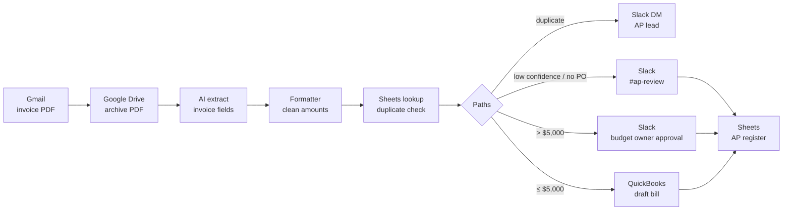

# 06 · AI Invoice Processing – Accounts Payable (Zapier + AI)

**Platform:** Zapier · **AI:** ChatGPT (OpenAI) / AI by Zapier · **Apps:** Gmail, Google Drive, Google Sheets, Slack, QuickBooks Online
**Business area:** Finance / back-office operations

## The problem

Supplier invoices arrive as PDF attachments in an `invoices@` mailbox. A finance assistant opens each one, types vendor, invoice number, dates and amounts into a spreadsheet, saves the PDF to Drive, and chases managers by email for approval of larger invoices. It's slow, error-prone, and duplicate invoices occasionally get paid twice.

## The solution

A multi-step Zap that captures, extracts, checks and routes every invoice:

| Step | App & event | Configuration |
|------|-------------|---------------|
| 1 | **Gmail** · New Attachment | Search: `to:invoices@company.com has:attachment filename:pdf` |
| 2 | **Google Drive** · Upload File | Folder `/Finance/Invoices/{{zap_meta_human_now}}`; keep file link |
| 3 | **ChatGPT** · Extract Structured Data (or *AI by Zapier* · Analyze and Return Data) | Fields below, from the PDF text |
| 4 | **Formatter by Zapier** · Numbers → Format Number | Normalise `total_amount` to 2 decimals |
| 5 | **Google Sheets** · Lookup Spreadsheet Row | Look up `vendor + invoice_number` in *AP Register* → **duplicate check** |
| 6 | **Paths by Zapier** | See routing table |
| 7 | **Google Sheets** · Create Spreadsheet Row | Log every non-duplicate invoice with status |

### Extracted fields

`vendor_name`, `vendor_email`, `invoice_number`, `invoice_date`, `due_date`, `currency`, `subtotal`, `tax`, `total_amount`, `po_number`, `line_items_summary`, `confidence` (High/Medium/Low)

### Routing (Paths)

| Path | Condition | Actions |
|------|-----------|---------|
| ⛔ Duplicate | Lookup in step 5 found a row | Slack DM to AP lead: "Possible duplicate invoice" + both links. **Stop.** |
| ⚠️ Needs review | `confidence ≠ High` **or** `po_number` empty | Slack `#ap-review` with Drive link; Sheets status = `Needs review` |
| ✅ Approval required | `total_amount > 5,000` | Slack message to budget owner with invoice summary; Sheets status = `Awaiting approval` |
| 🟢 Auto-post | `total_amount ≤ 5,000` and confidence High and PO present | **QuickBooks Online** · Create Bill (draft); Sheets status = `Bill created` |

## Architecture



## AI extraction prompt

```text
Extract the following fields from this supplier invoice. Return ONLY JSON.
If a field is not present, return null — do not guess.
{"vendor_name": "", "vendor_email": "", "invoice_number": "", "invoice_date": "YYYY-MM-DD",
 "due_date": "YYYY-MM-DD", "currency": "ISO code", "subtotal": 0.00, "tax": 0.00,
 "total_amount": 0.00, "po_number": "", "line_items_summary": "max 20 words",
 "confidence": "High|Medium|Low"}
Set confidence to Low if the document is not clearly an invoice, is hard to read,
or subtotal + tax does not equal total_amount.
```

## Controls built in

- **Duplicate detection** before anything is posted to accounting.
- **Threshold approval** — invoices above $5,000 always need a named approver.
- **Low-confidence fallback** — the AI's own confidence and a math check (subtotal + tax = total) route unclear invoices to a human.
- **Bills are created as drafts** in QuickBooks — payment still requires a person.
- **Audit trail** — every invoice has a row in the AP Register with the Drive link and status.

## Files

| File | Purpose |
|------|---------|
| `sample-invoice-extraction.json` | Example AI output for three invoices and the path each one takes |

## Expected impact

| Metric | Before | After |
|--------|--------|-------|
| Data entry per invoice | ~6 min | ~0 (review exceptions only) |
| Monthly effort (300 invoices) | ~30 hrs | ~5 hrs |
| Duplicate payments | Occasional | Flagged before posting |

Zapier tasks: ~7 per invoice → ~2,100 tasks/month for 300 invoices (Zapier Professional tier).
